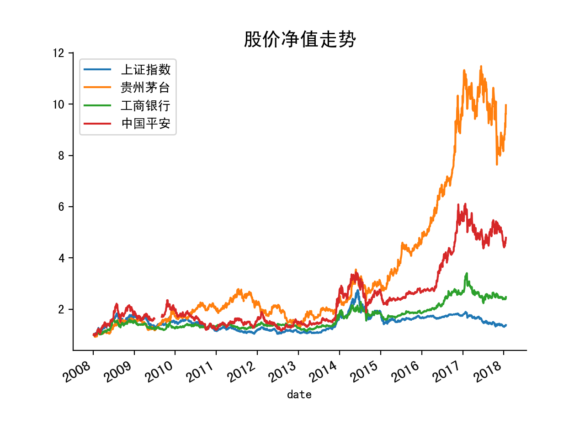
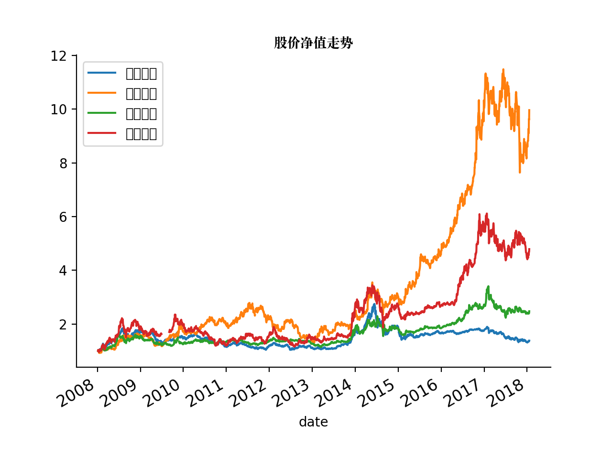

## matplotlib中文显示乱码
### 添加修改相应字体文件
- 添加SimHei字体（simhei.ttf文件）
[百度网盘](https://pan.baidu.com/s/1cmbE566U_JNzDy63iL3dIw), 提取码：cdss
[地址2](https://www.fontpalace.com/font-download/SimHei/)
[地址3](http://www.font5.com.cn/font_download.php?id=151&part=1237887120)
文件下载后拷贝至目录 ～/miniconda3/envs/py3/lib/python3.6/site-packages/matplotlib/mpl-data/fonts/ttf 下，**不同的环境有所不同**。
- 删除~/.matplotlib/下的所有缓存文件
```bash
rm -rf ~/.matplotlib/*.cache
```
- 删除~/.matplotlib/下的fontList.json
```bash
rm -f ~/.matplotlib/fontList.json
```
如果是Ubuntu系统，则直接删除~/.cache/matplotlib 目录
```bash
rm -rf ~/.cache/matplotlib
```
- 程序中添加设置
```python
import matplotlib.pyplot as plt
# 指定默认字体
plt.rcParams['font.sans-serif']=['SimHei'] 
plt.rcParams['font.family']='sans-serif' 
# 用来正常显示负号
plt.rcParams['axes.unicode_minus']=False
```
在mac系统下实测过，pandas+matplotlib绘图后，图中标题和图例中的中文均能显示正常。
1. 乱码显示

2. 正常显示

### 在代码中添加属性配置
- 导包
```python
from matplotlib.font_manager import FontProperties
font = FontProperties(fname="/Library/Fonts/Songti.ttc")
#或者下面这条语句
#font = FontProperties(fname="/System/Library/Fonts/PingFang.ttc")
```
- 代码中设置 fontproperties
```python
plt.title(u"股价净值走势", fontsize=15, fontproperties=font)
```
在mac系统中测试，pandas+matplotlib绘图标题正常图例中的中文依然乱码。



### 源代码
```python
#coding:utf-8 

from matplotlib.font_manager import FontProperties
font = FontProperties(fname="/Library/Fonts/Songti.ttc")
#font = FontProperties(fname="/System/Library/Fonts/PingFang.ttc")

import pandas as pd
import numpy as np
import matplotlib.pyplot as plt
"""
# 指定默认字体
plt.rcParams['font.sans-serif']=['SimHei'] 
plt.rcParams['font.family']='sans-serif' 
# 用来正常显示负号
plt.rcParams['axes.unicode_minus']=False
"""
import tushare as ts

def get_data(code, start="2009-01-01", end="2019-01-18"):
    df = ts.get_k_data(code, start=start, end=end)
    df.index = pd.to_datetime(df.date)
    return df.close

if __name__ == "__main__":
    stocks = {"sh":"上证指数", "600519":"贵州茅台", "601398":"工商银行", "601318":"中国平安"}
    df = pd.DataFrame()
    for code, name in stocks.items():
        df[name] = get_data(code)
    print(df.head())
    df_new = df / df.iloc[0]
    #df_new.plot(figsize=(16, 7))
    df_new.plot()
    plt.title(u"股价净值走势", fontsize=15, fontproperties=font)
    my_ticks = pd.date_range("2008-01-01", "2019-01-18", freq="Y")
    plt.xticks(my_ticks, fontsize=12)
    ax = plt.gca()
    ax.spines["right"].set_color("none")
    ax.spines["top"].set_color("none")
    plt.show()
```